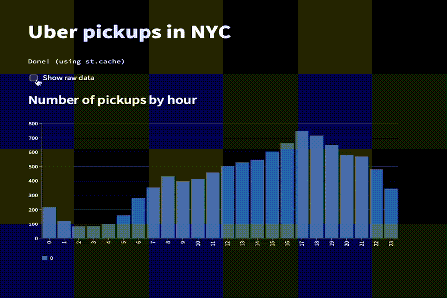
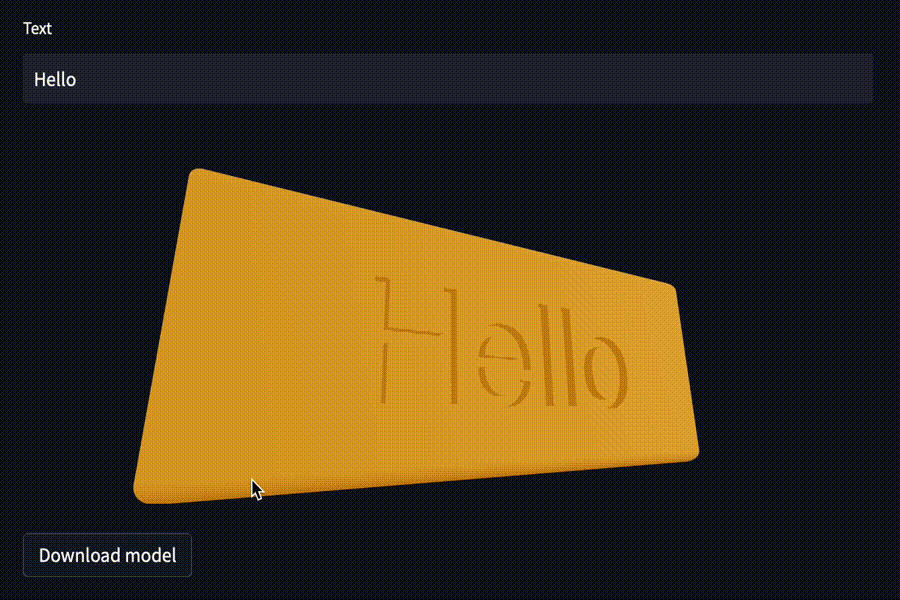

I have been toying around with generating customizable 3d models for 3d printing for a while now. I wrote code to generate cookie cutters, name clips for charging cables and a few other things.
Recently I had the idea to use streamlit to create a UI for the creation of those customizable models.

In this post I will use a simple example to showcase how this can be done.
The example will be a simple badge with a customizable text embossed on it.
I will use cadquery to generate the 3d model with python code and streamlit to create a web interface for generating the model.

## [Cadquery](https://github.com/CadQuery/cadquery)
> A python parametric CAD scripting framework based on OCCT

Cadquery is a python library that allows to create 3d models with python code.
It is based on a powerful 3d modeling engine called OpenCascade.

In contrast to OpenSCAD, which is another tool to programmatically generate 3d models, cadquery is based on python which makes it really easy to get started with it as you don't have to learn some new language.

```python
# The dimensions of the box. These can be modified rather than changing the
# object's code directly.
length = 80.0
height = 60.0
thickness = 10.0
center_hole_dia = 22.0

# Create a box based on the dimensions above and add a 22mm center hole
result = (cq.Workplane("XY")
            .box(length, height, thickness)
            .faces(">Z")
            .workplane()
            .hole(center_hole_dia))
```
This is a simple example from the [docs](https://cadquery.readthedocs.io/en/latest/quickstart.html) which generates a box with a hole in the center. 
You can see that the first step is the creation of a box on the XY plane. Next a hole is added on the positive Z plane of the box. The `>Z` string that is used here is an example for a selector. Selectors are a powerful way to select faces, edges, or vertices in your model and are at the same time pretty intuitive. You can read more about them [here](https://cadquery.readthedocs.io/en/latest/selectors.html).

## [Streamlit](https://streamlit.io)
> A faster way to build and share data apps

Streamlit is usually used for creating interactive data science web applications.
It does this by allowing you to write python code to render interactive elements on a page.

```python
st.title('Uber pickups in NYC')

data = load_data(10000)

if st.checkbox('Show raw data'):
    st.subheader('Raw data')
    st.write(data)

st.subheader('Number of pickups by hour')
hist_values = np.histogram(...)
st.bar_chart(hist_values)
```

This is an simplified example from the streamlit [docs](https://docs.streamlit.io/library/get-started/create-an-app).
It renders a checkbox that can be checked to show the data in a table and below that it displays a histogram of the data.
By using the checkbox method call inside the if statement condition the table is only rendered when the checkbox is checked.

The result looks like this:



I really like this approach to build simple user interfaces, because you don't have to worry about writing html/css/js + something on the server side and instead you just write a few lines of python code and get a good looking web interface.
Of course this approach is not feasible for complex or bigger web applications, but I think especially in the context of interactive data apps this is really cool.


## Combining the two tools
Next up we will see how we can combine cadquery and streamlit to build a simple web interface for generating customizable 3d models.

We use cadquery to define a function that creates a 3d model and saves this model as a stl file. The model is a box with rounded edges and text embossed in it.
```python
def generate_model(text: str):
    model = (cq.Workplane()
            .box(20, 8, 2)
            .edges("|Z")
            .fillet(1)
            .faces(">Z")
            .workplane().text(text, 5, -0.4)
        )
    _, path = tempfile.mkstemp(suffix='.stl')
    cq.exporters.export(model, path)
    return path 
```

Next up we use streamlit to render an input element and based on the value of this field we generate the model and show it using a custom streamlit component. Additionally we add a download button to enable downloading the model.

The custom streamlit component uses threejs under the hood to render the model in the browser and I will probably write a separate post about this component and publish it to the python registry later on.

```python
text = st.text_input("Text")

if text != "":
    stl_path = generate_model(text)
    sv.stl_viewer(stl_path)
    with open(stl_path, 'rb') as f:
        st.download_button(
            label="Download model",
            data=f.read(),
            file_name='model.stl')
    os.remove(file)
```

And that is all we need to do. The result is a simple interface to generate customizable 3d models that can then be downloaded and 3d printed.



